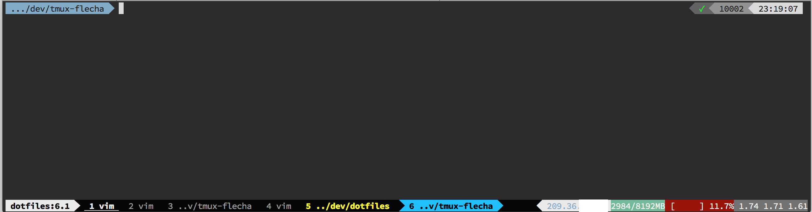

# Flecha Tmux Theme

A tmux theme.



It contains mostly status bar, window and pane border styles. No key bindings defined.

Inspiration:

- tmux powerline: https://github.com/erikw/tmux-powerline
- maglev theme: https://github.com/caiogondim/maglev
- zanshin tmux.conf: https://github.com/zanshin/dotfiles/blob/master/tmux/tmux.conf
- gpakosz/.tmux: https://github.com/gpakosz/.tmux

## Requirements

- Tmux: http://tmux.github.io/
- Powerline patched fonts: https://github.com/powerline/fonts
- Tmux Plugin Manager (recommended): https://github.com/tmux-plugins/tpm
- tmux-mem-cpu-load (optional): https://github.com/thewtex/tmux-mem-cpu-load

## Installation with Tmux Plugin Manager (recommended)

Add the plugin to the TPM plugin list in `.tmux.conf`:

```sh
set -g @plugin 'labianchin/tmux-flecha'
```

## Manual Installation

Clone the repo:

```
$ git clone https://github.com/labianchin/tmux-flecha ~/.tmux-flecha
```

Add this line to the bottom of `.tmux.conf`:

```
run-shell ~/tmux-flecha/flecha.tmux
```

Reload TMUX environment with: `$ tmux source-file ~/.tmux.conf`. You should now be able to see the theme.

## Installation with Tundle

https://github.com/chilicuil/tundle

Add the following to `.tmux.conf`:

```
setenv -g @bundle "labianchin/tmux-flecha"
```

## Other recommended plugins

I use TPM and recommend the following plugins:

```
set -g @plugin 'tmux-plugins/tmux-sensible'
set -g @plugin 'tmux-plugins/tmux-pain-control'
set -g @plugin 'tmux-plugins/tmux-copycat'
set -g @plugin 'tmux-plugins/tmux-yank'
set -g @plugin 'tmux-plugins/tmux-open'
```

## License

MIT
